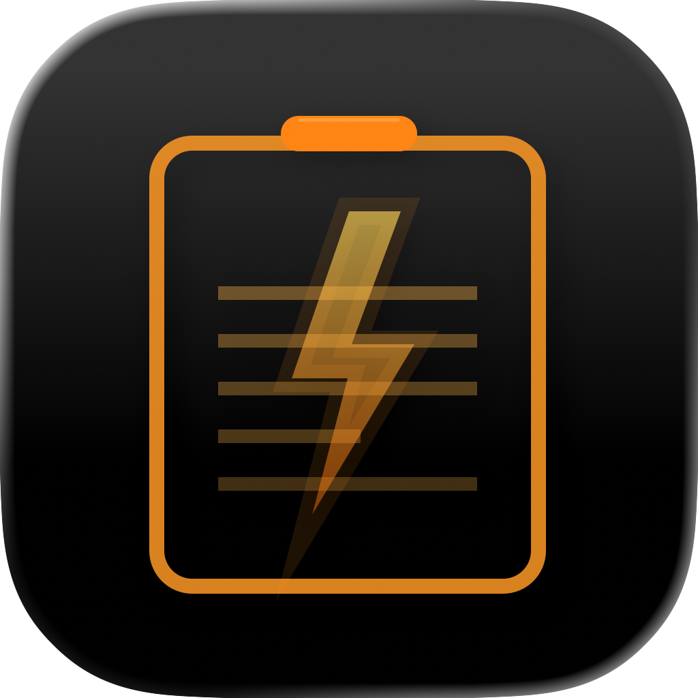

# &nbsp;BoltClip

<br>

> [!NOTE]
> The original [Clipy](https://github.com/Clipy/Clipy) repository has not been maintained for several years and is difficult to build with recent versions of Xcode. This repository was started to address that and keep the project alive.

BoltClip is a Clipboard extension app for macOS.

---

__Requirement__: macOS 14.6 Sonoma or higher

## Installation

### Download from Releases

1. Go to [GitHub Releases](https://github.com/takebozu/BoltClip/releases)

2. Download the latest `BoltClip.zip`

3. Extract the zip file

4. Drag and drop `BoltClip.app` to your **Applications** folder

### Build from Source

1. Clone the repository:
```bash
git clone https://github.com/takebozu/BoltClip.git
cd BoltClip
```

2. Open the project in Xcode:
```bash
open Clipy.xcodeproj
```

3. Select the **BoltClip** scheme from the scheme selector

4. Build and run the project:
   - Press `Cmd + R` to build and run
   - Or go to **Product** > **Run** in the menu

5. The app will launch automatically. You can quit it and access BoltClip from the menu bar.

6. To install, drag and drop `BoltClip.app` from the build output to your **Applications** folder

### Development Environment
* macOS 26.4 Tahoe
* Xcode 26.4
* Swift 5

### Distribution
If you distribute derived work, especially in the Mac App Store, I ask you to follow two rules:

1. Don't use `BoltClip`, `Clipy` and `ClipMenu` as your product name.
2. Follow the MIT license terms.

Thank you for your cooperation.

### License
BoltClip is available under the MIT license. See the LICENSE file for more info.

Icons are copyrighted by their respective authors.

### Special Thanks
Thank you to the original developers who published a brilliant app as open source.

- [@Econa77](https://github.com/Econa77) and Clipy project contributors who published [Clipy](https://github.com/Clipy/Clipy).
- [@naotaka](https://github.com/naotaka) who published [ClipMenu](https://github.com/naotaka/ClipMenu).
