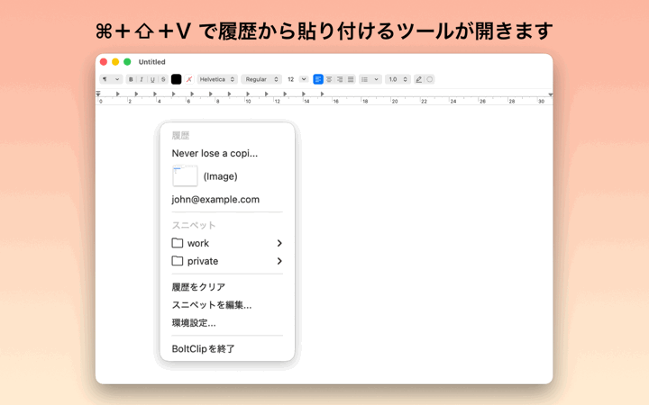
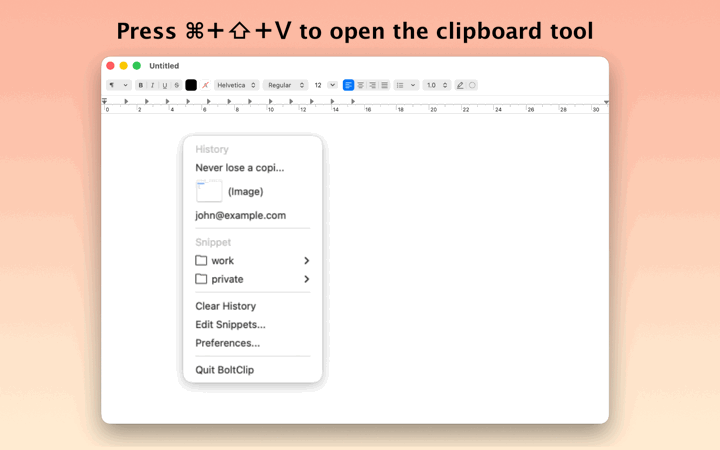

# &nbsp;BoltClip

<br>

> [!NOTE]
> The original [Clipy](https://github.com/Clipy/Clipy) repository has not been maintained for several years and is difficult to build with recent versions of Xcode. This repository was started to address that and keep the project alive.

## Introduction

<details>
<summary>日本語</summary>

### 一歩先のワークフローへ。コピー＆ペーストをもっと自由に。

「さっきコピーしたテキスト、どこにいった？」そんな悩みはもう必要ありません。
BoltClip（ボルトクリップ）は、macOSのために設計された軽量で高機能なクリップボード管理アプリです。シンプルで洗練されたインターフェースにより、作業のリズムを止めることなく、過去のコピー履歴へ瞬時にアクセスできます。またよく使うテキストをスニペットとして登録しておくことができます。

### 主な機能

- 履歴保存: テキスト、リンク、コードスニペットなど、コピーした内容を自動保存。必要な時にいつでも呼び出せます。
- キーボードで完結: カスタマイズ可能なグローバルホットキーに対応。マウスを触ることなく、キーボード操作だけで履歴の呼び出しから貼り付けまで完了します。
- ネイティブな操作感: macOSのデザイン言語に溶け込むミニマルな設計。動作は非常に軽く、システムへの負担も最小限です。
- プライバシー重視: クリップボードのデータは、あなたのMac内だけで処理されます。外部サーバーへの送信や追跡は一切行われません。

### アクセシビリティ権限の使用について

BoltClipは、最高かつスムーズな体験を提供するためにmacOSの「アクセシビリティ」権限を利用します。これにより以下の機能が可能になります：

- ショートカットキーによる履歴一覧やスニペットの即時表示
- 選択したクリップボード履歴やスニペットを貼り付け

### Screenshots



</details>

<details open>
<summary>English</summary>

### Effortless Productivity, One Click Away.

Stop losing track of your copy-paste history. BoltClip is a lightweight, high-performance clipboard manager designed for macOS, built to keep your workflow fluid and your data organized. Whether you are a developer, writer, or designer, BoltClip ensures that everything you copy is saved and ready for reuse.

### Features You’ll Love

- Clipboard History: Access a list of everything you’ve copied — so you never lose a piece of information again.
- Keyboard-Centric: Designed for power users. Use customizable global hotkeys to toggle your history and paste snippets without your hands ever leaving the keyboard.
- Clean & Native: A minimalist interface that feels right at home on macOS. No bloat, no distractions—just your data when you need it.
- Privacy First: Your clipboard data stays where it belongs: on your machine. BoltClip does not track your data or send it to the cloud.

### Why Accessibility Permissions?

To provide a seamless experience, BoltClip utilizes macOS Accessibility features. This allows the app to:

- Detect your custom global hotkey to bring up your clipboard history and snippets instantly.
- Paste item directly into your active application

### Screenshots



</details>

---

## Requirement

macOS 14.6 Sonoma or higher

## Installation

### Download from Releases

1. Go to [GitHub Releases](https://github.com/takebozu/BoltClip/releases)

2. Download the latest `BoltClip.zip`

3. Extract the zip file

4. Drag and drop `BoltClip.app` to your **Applications** folder

### Build from Source

1. Clone the repository:
```bash
git clone https://github.com/takebozu/BoltClip.git
cd BoltClip
```

2. Open the project in Xcode:
```bash
open Clipy.xcodeproj
```

3. Select the **BoltClip** scheme from the scheme selector

4. Build and run the project:
   - Press `Cmd + R` to build and run
   - Or go to **Product** > **Run** in the menu

5. The app will launch automatically. You can quit it and access BoltClip from the menu bar.

6. To install, drag and drop `BoltClip.app` from the build output to your **Applications** folder

### Development Environment
* macOS 26.4 Tahoe
* Xcode 26.4
* Swift 5

### Distribution
If you distribute derived work, especially in the Mac App Store, I ask you to follow two rules:

1. Don't use `BoltClip`, `Clipy` and `ClipMenu` as your product name.
2. Follow the MIT license terms.

Thank you for your cooperation.

### License
BoltClip is available under the MIT license. See the LICENSE file for more info.

Icons are copyrighted by their respective authors.

### Special Thanks
Thank you to the original developers who published a brilliant app as open source.

- [@Econa77](https://github.com/Econa77) and Clipy project contributors who published [Clipy](https://github.com/Clipy/Clipy).
- [@naotaka](https://github.com/naotaka) who published [ClipMenu](https://github.com/naotaka/ClipMenu).
